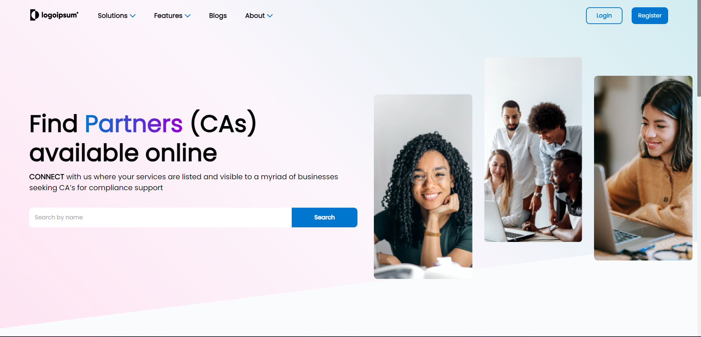

**Project Title:** Full Stack Website Development Challenge

### Home Page

**Project Description:**

**Project Overview:**
This project involved the creation of a full-stack website based on a provided Figma design, with the goal of replicating the design as accurately as possible. The website was built using a modern technology stack, including React.js for the front-end, and Node.js with Express.js for the back-end. The website consists of three main pages: a Landing page, a Partner Landing page, and a Search page, each of which presented unique challenges and learning opportunities.

**Project Details:**

1. **Landing Page:**
   The Landing page was the first point of interaction for users, and it featured a complex layout with multiple intricate sections. To achieve the desired design, various CSS techniques such as grid and flexbox were employed. This page was responsible for creating a visually appealing and engaging user experience.

2. **Partner Landing Page:**
   The Partner Landing page displayed detailed information about a partner. This page included various elements, including a side panel, a main panel, lists, boxes, and more. Replicating this page required meticulous attention to detail and a deep understanding of responsive web design to ensure that all elements were rendered correctly and aesthetically.

3. **Search Page:**
   It displayed the all the results of a user search after the user clicks "view all" in the dynamic search dropdown menu.

**Key Achievements and Learning:**
During the development of this website, several new skills and concepts were learned and implemented:

1. **Dynamic Search Dropdown Box:**
   The project required the development of a dynamic search dropdown box, where the website displays relevant search results as the user types. This feature enhances the website's usability and demonstrates the ability to work with real-time data.

2. **Random Recommendations for Partners:**
   The website incorporated a feature for generating random partner recommendations. This feature added a personalized touch to the user experience and involved working with algorithms to select and display relevant recommendations.

**Technologies Used:**

- **Front-end:** React.js
- **Back-end:** Node.js with Express.js
- **Database:** Local JSON File
- **Front-end Libraries and Tools:** Axios
- **Version Control:** Git
- **Deployment:** Netlify
